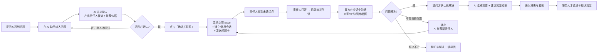
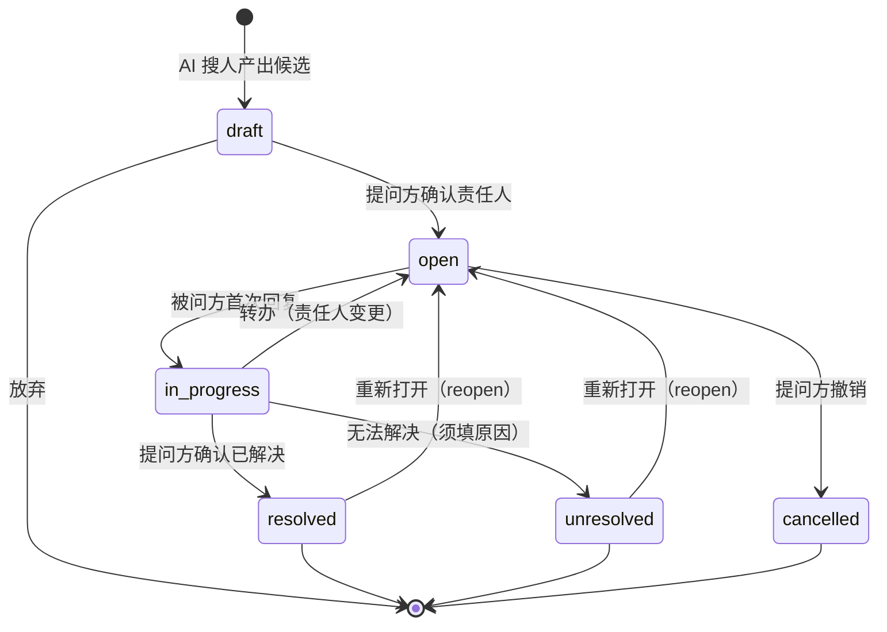

# FpIM 产品需求文档（PRD）

> **文档编号**：01　｜　**版本**：v1.0（基于《重构方案-IM化与问题闭环》v3 定稿）
> **日期**：2026-09-17　｜　**状态**：待评审
> **适用阶段**：P0 ~ P3　｜　**目标平台**：Windows / macOS 桌面端（PC 优先）
> **读者**：产品、开发、测试、业务方、领导汇报

---

## 目录

1. [文档说明](#1-文档说明)
2. [产品定位与目标](#2-产品定位与目标)
3. [用户角色与权限](#3-用户角色与权限)
4. [核心业务流程](#4-核心业务流程)
5. [功能需求清单](#5-功能需求清单)
6. [问题状态机与业务规则](#6-问题状态机与业务规则)
7. [指标口径定义](#7-指标口径定义)
8. [范围边界](#8-范围边界)
9. [非功能需求](#9-非功能需求)
10. [上线计划与验收标准](#10-上线计划与验收标准)
11. [风险与依赖](#11-风险与依赖)

---

## 1. 文档说明

### 1.1 术语表

| 术语 | 含义 |
|---|---|
| **首问责任平台** | 现有系统（findperson），提供 AI 找人与知识问答能力 |
| **提问方** | 遇到问题、发起提问的员工 |
| **被问方 / 责任人** | 被认定应解决问题的人，一个问题同时只有**一个**责任人 |
| **issue / 问题** | 一条被立项追踪的求助事项，有状态、责任人、留痕 |
| **立项** | 把一次提问转为可追踪 issue 的动作（提问方确认责任人后触发） |
| **会话** | IM 中的对话容器，含单聊（direct）与群聊（group） |
| **留痕** | 问题从提出到关闭的全过程记录（消息、已读、状态、结论） |
| **已读留痕** | 责任人首次打开问题卡时记下的不可撤销时间戳 |
| **职责模糊地图** | 部门被问量分布的呈现形态，输出"该沉淀哪些知识"，不输出排名 |
| **小管家** | 平台官方服务号（bot），负责通知、报表推送、数据问答 |
| **AI 助手** | 现有智能问答入口，负责找人、知识问答 |
| **转办** | 责任人判定"这不是我负责的"，转交他人的动作 |

### 1.2 项目性质（写给评审人的一句话）

> 本次不是"给平台加个聊天功能"，而是**把产品闭环从「找到人」延长到「解决问题并留下证据」**。
>
> 现状：AI 把人找对了，然后信息掉进线下邮件的黑洞，过程全部丢失。
> 目标：`提问 → AI 搜人 → 一键进会话 → 沟通全程留痕 → 标记解决 → 沉淀报表 → 服务人才选拔`

### 1.3 三条产品原则（由领导管理理念翻译而来）

| 管理理念 | 产品原则 | 落地机制 |
|---|---|---|
| 制造麻烦逼被询问者解决 | **一问即留痕** | 问题一经立项即进入可追踪状态；责任人**一读就摘不掉**（已读是硬证据） |
| 过程即数据 | **全过程可回溯** | 每段对话、每次转办、每个解决结论都是考核素材，可追溯到具体事件 |
| 画像排名服务人才选拔 | **数据服务决策** | 个人主页挂载被问/解决/知识贡献指标，进选拔须有下游动作背书 |

> ⚠️ **本期不做**自动超时提醒与升级（见 §8 范围边界）。倒逼力来自"读取即留痕"与"公开看板牵引"，而非系统自动追责。

---

## 2. 产品定位与目标

### 2.1 一句话定位

**一个以「问题闭环」为内核的企业协作平台**：用 IM 做沟通载体，用问题状态机做责任追踪，用报表把"谁的贡献可见"变成组织决策依据。

### 2.2 与通用 IM 的区别（差异化价值在聊天之外）

| 能力 | 飞书 / 微信等通用 IM | FpIM |
|---|---|---|
| 聊天 | ✅ 完整 | ✅ 标配（文字/图片/文件/音视频/群聊/已读） |
| 找人 | ❌ 靠人力搜索或熟人推荐 | ✅ **AI 语义搜人 + 可解释推荐依据** |
| 问题追踪 | ❌ 无 | ✅ **问题状态机 + 已读留痕 + 转办链路** |
| 解决结果 | ❌ 无 | ✅ **提问方确认解决 + 结论沉淀** |
| 统计报表 | ❌ 无 | ✅ **职责分布 / 响应画像 / 知识缺口** |
| 人才选拔 | ❌ 无 | ✅ **指标可追溯到事件，进选拔需动作背书** |

### 2.3 成功指标

**北极星指标**：**周活跃问题闭环率** = （本周已解决的 issue 数 / 本周立项的 issue 数）× 100%

| 层级 | 指标 | 目标（上线 3 个月） |
|---|---|---|
| 采用 | 日活用户占比 | ≥ 70%（208 人规模） |
| 采用 | 人均周提问数 | ≥ 1.5 |
| 闭环 | 问题解决率 | ≥ 60% |
| 闭环 | **已读未回复率**（核心风险指标） | ≤ 20% |
| 效率 | 首次已读时长中位数 | ≤ 2 小时（工作时间内） |
| 沉淀 | 月新增知识条目 | ≥ 10 条 |
| 替代 | 线下邮件求助占比 | 下降至 < 10% |

> **设计说明**：不设"响应时限达标率"——本期没有约定时限，就不该有"达标"概念。给管理者看的是**趋势与异常**，用分位数而非合格线。

---

## 3. 用户角色与权限

### 3.1 角色定义

| 角色 | 说明 | 核心诉求 | 主要痛点 |
|---|---|---|---|
| **提问方** | 遇到问题需要帮助的员工 | 快速找到对的人、问题被真正解决、能追踪进度 | 不知道找谁；问出去没回音；问题反复踢皮球 |
| **被问方 / 责任人** | 被认定应解决问题的人 | 少被打扰、问题描述清晰、**有据可查不背锅**、贡献被看见 | 被当作万能客服；接了活没完没了；干了活没人知道 |
| **管理者** | 部门负责人、公司领导 | 看清责任分布、发现知识缺口、拿到可信数据用于评价与选拔 | 数据靠人工统计不可信；不清楚哪个环节卡住 |
| **平台管理员** | IT / HR 运维 | 权限可控、审计可查、系统稳定 | 越权访问、数据泄露、故障无法定位 |

### 3.2 系统角色

| 角色 | 定位 | 能力 |
|---|---|---|
| **AI 助手** | 找人与知识问答入口（现有 `/ask`） | 语义搜人、知识检索、生成立项草稿 |
| **小管家** | 平台官方服务号（bot） | 通知下发、报表卡推送、数据问答 |

> **为什么要分成两个常驻入口**：通知流与对话流必须分开。否则领导的重要报表会被几十条提问刷掉。参考飞书的"服务号"形态。

### 3.3 权限矩阵

| 功能/数据 | 普通员工 | 管理者 | 平台管理员 |
|---|---|---|---|
| 通讯录查看 | ✅ 全员 | ✅ | ✅ |
| 个人主页查看 | ✅ 全员（公开字段） | ✅ | ✅ |
| 发起会话（免加好友） | ✅ 全员 | ✅ | ✅ |
| 查看自己的 issue | ✅ | ✅ | ✅ |
| 查看本部门 issue 明细 | ❌ | ✅ | ✅ |
| 查看全公司 issue 明细 | ❌ | ❌（仅聚合视图） | ✅ |
| 报表看板（正向榜） | ✅ 全员公开 | ✅ | ✅ |
| 报表看板（个人拖延/未回复明细） | ❌ | ❌ | ✅ |
| 报表卡推送 | 接收与自己相关 | ✅ 部门/全公司 | ✅ |
| 消息审计检索 | ❌ | ❌ | ✅（须留审计日志） |
| 系统配置（时限/模板等） | ❌ | ❌ | ✅ |

**三条权限铁律**：
1. **小管家只能推给你有权看的内容** —— 服务端强制校验，不靠前端隐藏。
2. **全局搜索默认收敛在"我参与的会话"**，跨会话检索走权限过滤。
3. **审计操作必须留痕**（复用现有 `audit_logs`），管理员也是被审计对象。

---

## 4. 核心业务流程

### 4.1 主链路（端到端）

### 4.2 关键场景

#### 场景 S1：新员工求助（最典型）

> 小王入职两周，需要申请报销系统权限，不知道找谁。
> ① 在 AI 助手输入"报销系统权限申请应该找谁" → AI 返回 3 张人员名片，附命中依据（"负责财务系统权限管理"）
> ② 小王点第一张卡片的「确认并联系」→ 系统创建议题、打开与责任人的会话、自动发出问题卡
> ③ 责任人小李打开会话 → 记录首次已读 → 回复操作步骤
> ④ 小王照做成功 → 点「已解决」→ AI 生成摘要并提示"这类问题已出现 8 次，建议沉淀为知识"

#### 场景 S2：跨部门转办

> 小李看到问题后发现"这是行政部的职责" → 点「转办」→ AI 推荐 2 位候选人 → 选中小张 → issue 责任人变更，小张收到新问题卡；提问方看到"已转办至行政部 小张"，**原本的沟通记录完整保留**。

#### 场景 S3：复杂问题多人会诊

> 问题涉及财务 + 法务 → 提问方从问题卡上点「拉群会诊」→ 创建问题群（含责任人 + 相关同事）→ 群内讨论全程留痕。
> ⚠️ **关键规则**：**群聊只解决"多人沟通效率"，不改变责任归属**。立项时必须从群成员中指定**唯一责任人**（默认群主），否则"集体负责 = 无人负责"，整个考核基础塌陷。

#### 场景 S4：领导查看报表

> 周一早 9:00，领导在「小管家」会话中收到周报卡：提问量趋势、解决率、知识缺口 TOP10、帮助榜。点击卡片可展开完整看板。

#### 场景 S5：领导数据追问

> 领导直接问小管家："本周哪个部门被问最多？" → 小管家返回**知识缺口地图卡**（不是排行榜），标注"这几类高频问题建议沉淀知识"。

### 4.3 流程分支的处理原则

| 分支 | 处理 | 设计理由 |
|---|---|---|
| 责任人点「这不是我负责的」 | 走转办，须选新责任人 | 允许纠错，但必须给出接手方，不能"甩手即走" |
| 转办后原责任人 | 记录 `handoff` 事件，计入"转办链" | 避免恶意转办（转办率是画像维度） |
| 提问方长时间不确认解决 | 无强制关闭机制 | 提问方是服务对象，不给他制造麻烦 |
| **被问方自己点已解决** | ❌ **禁止** | 去掉时限后最容易被钻的空子，必须由提问方确认 |
| 问题反复（reopen） | 记录事件，计入画像 | 识别"假解决" |
| 提问方撤销 | 允许，记 `cancelled` | 但不计入解决率 |

---

## 5. 功能需求清单

> 优先级说明：**P0** = 首期必须（三个并行轨道）；**P1** = 汇合期；**P2** = 个人主页与小管家；**P3** = 报表与看板。
> 验收标准采用「给定…当…则…」格式，可直接转测试用例。

### F1 通讯录与组织架构｜P2

**目标**：从"人员名录"升级为可直达对话的通讯录。

**用户故事**：作为员工，我希望按部门浏览同事并直接发消息，不用先加好友。

**需求点**：
1. 组织树（复用现有 `departments`）+ 人员列表，展示姓名/头像/岗位/部门/直属上级。
2. 点击任意人员 → 侧边卡片 → 「发消息」直接进入会话（**无需好友关系**）。
3. 支持按姓名/拼音/部门搜索。
4. 人员详情可跳转个人主页。

**验收标准**：
- 给定通讯录页面，当点击任一同事的「发消息」，则 1 秒内打开单聊会话且可立即发送消息。
- 给定搜索框，当输入"zhangsan"或"张三"或"zs"，则返回匹配人员列表（拼音全拼/首字母均支持）。
- 给定任一人员，当查看其信息，则可见直属上级姓名且可点击跳转。

---

### F2 个人主页｜P2

**目标**：把现有「个人中心 / 个人标签 / 个人自画像」合并为统一主页（对标飞书个人卡片）。

**用户故事**：作为员工，我希望在一个页面看到某人的职责、标签、被问与解决情况。

**需求点**：
1. **合并**：`/mine`（个人中心）+ `/profile/:id`（他人主页）统一为一个页面组件，仅"编辑权限"不同。
2. 信息分区：
   - 基本信息：头像、姓名、部门、岗位、**直属上级**（可点击跳转，对标飞书）
   - 职责与标签：复用现有标签三层模型（RawTag / Concept / 人员-标签关系）
   - 责任关系：现有 `responsibility_assignments` 展示（负责事项）
   - **数据画像**：被问数、解决数、帮助榜排名、知识沉淀数
   - 联系方式：现有 `people.contact`
3. 「发消息」按钮直达会话。
4. 自己查看自己时，可编辑标签以外的信息（沿用现有权限）。

**验收标准**：
- 给定任意人员主页，当查看直属上级，则可点击跳转至该上级主页。
- 给定个人主页，当显示画像数据，则数据来自报表接口且标注统计周期。
- 给定自己的主页，当点击编辑，则可修改简介等信息并保存生效。

---

### F3 会话与消息｜P0

**目标**：提供现代化 IM 的核心聊天能力。

**用户故事**：作为员工，我希望能像用飞书一样发消息、发文件、看未读。

**需求点**：

| # | 需求 | 说明 |
|---|---|---|
| 1 | 单聊 | 免加好友；同一对人**永远复用同一会话**（`direct_key` 幂等） |
| 2 | 群聊 | 上限 **100 人**；群名、群头像、群主、成员管理 |
| 3 | 消息类型 | 文字、图片、文件、语音、视频、系统消息、**问题卡**、解决确认、转办通知、AI 摘要、报表卡 |
| 4 | 附件支持格式 | 图片 jpg/png/gif/webp；文档 txt/doc/docx/pdf/xlsx/xls/csv/md；音视频 mp3/mp4；**单文件上限 100MB** |
| 5 | 富文本 | 支持 @提及（群聊）；消息引用回复 |
| 6 | 消息操作 | 复制、撤回（2 分钟内）、转发、下载附件 |
| 7 | 已读/未读 | 会话级游标；未读红点与计数；**责任人首次读取问题卡单独留痕** |
| 8 | 消息顺序 | 服务端 ID 单调排序，**不依赖客户端时间戳** |
| 9 | 离线与漫游 | 重连后增量拉取；消息永久保存，不做 365 天过期 |
| 10 | 多端一致性 | 同一账号多设备登录，消息状态一致 |

**验收标准**：
- 给定会话，当发送消息，则发送方立即看到"发送中→已送达"状态变化，对方在线时 1 秒内收到。
- 给定网络中断，当恢复连接，则期间的消息**不重复、不丢失、顺序正确**。
- 给定同一对人，当从通讯录或个人主页多次发起会话，则始终进入**同一个**会话（不产生重复会话）。
- 给定未读会话，当进入会话并滚动到底部，则未读数清零，且对方能看到读取状态。
- 给定 100 人上限的群，当尝试添加第 101 人，则提示达到上限并拒绝。

---

### F4 问题立项与闭环｜P0

**目标**：本产品的**核心差异化能力**。

**用户故事**：作为提问方，我希望问题被真正解决并且全程有据可查；作为责任人，我希望责任边界清晰、不被无端指责。

**需求点**：

| # | 需求 | 说明 |
|---|---|---|
| 1 | 立项入口 | AI 搜人结果页「确认并联系」；也可在会话中手动"把这条消息转为问题" |
| 2 | 问题卡 | 作为一条特殊消息进入会话，含：问题标题、提问人、责任人、状态徽标、操作按钮 |
| 3 | 责任人指定 | 必须唯一；群聊中立项必须从成员中指定（默认群主） |
| 4 | 状态流转 | `draft → open → in_progress → resolved / unresolved`，支持转办与重新打开 |
| 5 | **首次已读留痕** | 责任人首次打开问题卡时记录时间戳，**不可撤销、不可修改** |
| 6 | 转办 | 责任人可转办，须选择新责任人；AI 推荐候选（复用现有排序能力） |
| 7 | 解决确认 | **仅提问方可确认已解决**，须填写或自动生成解决结论 |
| 8 | 未解决 | 允许标记未解决，必须填原因 |
| 9 | AI 摘要 | 关闭时自动生成沟通摘要 + "建议沉淀为知识"提示 |
| 10 | 我的待办 | 被问方有独立视图：待我处理的问题、未读问题置顶高亮 |
| 11 | 提问方视图 | "对方已读但我还没得到回复"筛选 —— 提问方最需要的视图 |
| 12 | 来源可追溯 | 记录 AI 推荐依据与 trace_id，可回溯"为什么找的是他" |

**验收标准**：
- 给定 AI 推荐结果，当点击「确认并联系」，则 3 秒内创建 issue 并在会话中出现问题卡。
- 给定已立项问题，当责任人首次打开问题卡，则记录首次已读时间且**再次打开不会覆盖**。
- 给定进行中的问题，当被问方（非提问方）查看，则**看不到"确认已解决"按钮**。
- 给定问题，当提问方点击「已解决」，则状态变更、记录时间戳、触发 AI 摘要生成。
- 给定某个问题，当责任人转办给他人，则责任人变更、原责任人记入转办链、新责任人收到新问题卡。
- 给定"我的待办"，当有未读问题，则该问题置顶显示且高亮。

---

### F5 AI 搜人与知识问答｜P0（复用现有）

**目标**：完全复用现有智能主链，只增加出口。

**需求点**：
1. 保留现有 UI 结构：**左侧会话记录 + 右侧提问输入框**（ChatGPT 式）。
2. 搜人结果以**人员名片卡**呈现，必须给出具体命中依据（禁止"匹配度高"）。
3. 结果最多 3 张卡（沿用现有约束）。
4. 每条结果提供「确认并联系」按钮 → 直接立项。
5. 知识问答结果提供引用来源。
6. **AI 降级不影响 IM 与问题闭环**（AI 不可用时，IM 与状态机照常工作）。

**验收标准**：
- 给定提问"XX 事项找谁"，当 AI 返回结果，则每张卡片都显示具体命中依据。
- 给定 AI 服务不可用，当用户打开 IM 与查看问题卡，则功能完全正常。
- 给定找错人的情况，当用户点击「换个责任人」，则可手动搜索指定。

---

### F6 消息搜索｜P1

**需求点**：
1. 会话内搜索（必做）。
2. "我参与的会话"范围搜索。
3. 全局搜索**须加权限过滤**，默认范围限"我参与的会话 + 部门内公开群"。
4. 首期技术方案：`pg_trgm` 模糊匹配；P3 升级为应用层分词（详见技术文档）。

**验收标准**：
- 给定某会话，当搜索关键词，则高亮匹配消息并支持上下条跳转。
- 给定搜索他人未参与的私密会话，则**无法搜到**（权限过滤生效）。

---

### F7 报表与看板｜P3

**目标**：把留痕数据变成组织决策依据。

**需求点**：

| # | 看板模块 | 形态 | 说明 |
|---|---|---|---|
| 1 | **帮助榜** | 公开 | 被感谢次数、解决问题数、知识沉淀数（正向激励） |
| 2 | **知识缺口地图** | 公开 | 高频问题 TOP10 + "建议沉淀为知识"（**改进导向，保护被问方**） |
| 3 | **提问榜** | 公开 | 谁最爱提问（正面的"爱学习"标签） |
| 4 | **平台大盘** | 公开 | 提问量、解决率、平均响应时长趋势 |
| 5 | **部门被问分布** | 公开（聚合） | **以知识缺口形态呈现，不做排名** |
| 6 | 个人响应/解决明细 | **仅管理员** | 已读未回复明细、未解决率排名 —— 不公开 |

> **看板顶部必须常驻一句话**：**"被问量高说明这里缺知识、缺流程，不是这里的人不行。"**

**看板呈现原则（重要）**：
- 第 1 个月**只公开正向榜**，运行一个月后再评估是否加责任类维度（给组织适应期）。
- **反刷量铁律**：进榜指标必须有**下游动作背书**（已解决 / 被确认有效 / 沉淀为知识并被复用）。单纯"答得多""问得多"不计分。

**验收标准**：
- 给定看板页面，当查看任意榜单，则每个数字可下钻到具体 issue 列表（管理员权限）。
- 给定第 1 个月上线，当查看看板，则**不出现**任何个人拖延或未回复点名。
- 给定部门被问分布，当查看，则呈现为高频问题主题聚类，**而非部门排序**。

---

### F8 小管家（系统号）｜P2（通知）→ P3（报表）

**需求点**：
1. 在人员表增加一条 `role_type='bot'` 记录，复用通讯录/会话/消息/头像体系。
2. **三个能力**：
   - **主动通知**：立项确认、问题已解决、转办通知
   - **报表推送**：`report_card` 类型消息，含预览 + 展开入口（如每周一早 9:00 给领导推周报）
   - **数据问答**：跟小管家对话问数据（如"本周哪个部门被问最多"）→ 返回数据卡
3. 每个用户与小管家有一条常驻会话（置于左栏常驻区）。
4. **权限铁律**：只能推给有权看的内容（服务端强制校验）。

**验收标准**：
- 给定领导账号，当周一 9:00，则在小管家会话中收到周报卡且可展开查看完整看板。
- 给定普通员工，当询问全公司数据，则**拒绝返回**并提示权限不足。
- 给定问题状态变更，则相关方在小管家收到通知（提问方与责任人内容不同）。

---

### F9 桌面客户端｜P0（轨道 C）

**需求点**：

| 能力 | 要求 |
|---|---|
| 全局截图 | `Ctrl+Alt+A`（macOS `⌘⇧A`）截图后直接进聊天输入框 |
| 系统通知 | 新消息通知，点击跳转对应会话 |
| 开机自启 | 默认关闭，用户可开启 |
| 托盘常驻 | 显示未读数、有新消息闪烁 |
| 自动更新 | 走内网更新服务器 |
| 消息本地缓存 | 加快冷启动与历史滚动 |

**验收标准**：
- 给定客户端运行中，当按下 `Ctrl+Alt+A`，则进入截图模式且截图可直接粘贴进输入框发送。
- 给定收到新消息且窗口未聚焦，则弹出系统通知，点击后跳转到该会话。
- 给定新版本发布，当客户端启动，则提示更新并可完成自动升级。

---

### F10 设置与偏好｜P2

**需求点**：个人资料编辑、通知偏好（免打扰/声音）、会话置顶与免打扰、快捷键查看、关于与更新、退出登录。

---

## 6. 问题状态机与业务规则

### 6.1 状态定义

| 状态 | 含义 | 进入条件 |
|---|---|---|
| `draft` | 草稿 | AI 已给责任人候选，待提问方确认 |
| `open` | 已立项，待处理（被问方未读） | 提问方确认责任人 |
| `in_progress` | 处理中 | 被问方首次回复 |
| `resolved` | 已解决 | **提问方**确认 |
| `unresolved` | 未解决 | 双方放弃 / 解决不了，须填原因 |
| `cancelled` | 已撤销 | 提问方主动撤销 |
| `handoff` | 转办（过渡态） | 责任人变更，自动回到 `open` |

### 6.2 状态图

### 6.3 业务规则（BR）

| 编号 | 规则 | 说明 |
|---|---|---|
| **BR-01** | 一个问题**同时只有一个责任人** | 群聊不改变责任归属，立项时必须指定唯一责任人 |
| **BR-02** | **仅提问方可确认已解决** | 被问方无"已解决"按钮；这是防止"假解决"的关键 |
| **BR-03** | 首次已读只记一次 | `issue_events(read)`，不可撤销、不可覆盖 |
| **BR-04** | 只认**责任人**的已读 | 群聊中其他成员读取不计入该 issue 的首次已读 |
| **BR-05** | 转办须指定新责任人 | 不允许"退回群组"或"无人接手" |
| **BR-06** | 转办后新责任人重新计算首次已读 | 另记一条 `read` 事件 |
| **BR-07** | 所有状态变更必须写入 `issue_events` | 事件是唯一事实源，issues 表是投影 |
| **BR-08** | 未解决/撤销必须填写原因 | 保证数据可解释 |
| **BR-09** | 问题数据**长期保留** | 不做 365 天过期（否则考核无据） |
| **BR-10** | AI 不得直接修改 issue 状态、不得主动发消息 | 继承既有约束：AI 只产草稿与建议 |
| **BR-11** | 立项即建立问题卡消息 | 问题卡是会话中的锚点，保证沟通与问题关联 |
| **BR-12** | 会话复用 | 同一对人始终进入同一单聊会话，避免会话碎片化 |

### 6.4 已读/未读的产品规则（本期核心留痕机制）

| 项 | 规则 |
|---|---|
| 记录时机 | 责任人打开会话、问题卡进入可视区域时上报一次 |
| 存储位置 | 会话游标（供红点，会被覆盖）+ `issue_events.read`（供留痕，永不覆盖） |
| 群聊 | 其他人的已读**不**计入；只有责任人计入 |
| 呈现要求 | 问题卡显示状态徽标：`未读` / `已读 3 小时后回复` / `已读，未回复` |
| 提问方视图 | 可筛选"对方已读但我还没得到回复" |
| **禁止项** | ❌ 不展示"已读后停留多久"、❌ 不做"读了没回的天数排行" |

> **为什么禁止**：一旦变成考勤式监控，会引发"干脆不点开"的对抗行为，反而摧毁留痕本身。留痕的价值是"记录在案"，不是"实时监督"。

---

## 7. 指标口径定义

> 所有指标注册进现有 `statistics_definitions` 框架（`formula` 为一段 SQL + 定时刷新），确保**口径可追溯、可重算**。

### 7.1 指标清单

| # | 指标 | 口径定义 | 数据来源 | 进人才选拔 |
|---|---|---|---|---|
| M1 | 提问量 | 按提问人去重计数 issue 数 | `issues` | ❌ 仅观察 |
| M2 | 部门被问量 | 按 `owner_department_id` 计数 | `issues` | ❌ **以知识缺口地图呈现** |
| M3 | 有效问题率 | 被问方确认有效 / 总提问 | `issue_events` | 观察 |
| M4 | 首次已读时长 | `first_read_at - created_at`，输出**中位数 / 90 分位** | `issues` | ✅ 画像维度 |
| M5 | 首次回复时长 | `first_response_at - first_read_at`，同输出分位数 | `issues` | ✅ 画像维度 |
| M6 | **已读未回复率** | 有 `read` 事件但无 `responded` 的 issue 占比 | `issue_events` | ✅ **核心风险指标** |
| M7 | 解决率 | `resolved` / （`resolved` + `unresolved`） | `issues` | ✅ |
| M8 | 二次转办率 | 被转办 ≥2 次的 issue 占比 | `issue_events` | ✅（负向） |
| M9 | reopen 率 | 重新打开的 issue 占比 | `issue_events` | ✅（负向） |
| M10 | 知识沉淀贡献 | 沉淀为知识条数 + 被复用次数 | `contents` 关联 | ✅ |
| M11 | 帮助榜得分 | 被感谢次数 + 解决数 + 知识沉淀数 | 多源 | ✅ |
| M12 | 提问价值（三层漏斗） | L1 提问总量 → L2 有效问题率 → L3 已解决/沉淀为知识/触发流程改进 | 多源 | ✅ 仅 L3 |

### 7.2 反刷量规则

**铁律**：进榜指标必须有**下游动作背书** —— 已解决 / 被问方确认有效 / 沉淀为知识并被复用 / 提问方有效评价。

单纯"答得多""问得多"**不计分**。

### 7.3 指标的三条红线

1. ❌ **"部门被问最多"不做成排行榜**（会诱发推诿或刷量）→ 做成职责模糊地图。
2. ❌ **不公开个人拖延、已读未回复点名**（会诱发"不点开"对抗）。
3. ❌ **数量类指标只用于定位改进点**，只有被下游动作背书的指标才允许进人才选拔。

---

## 8. 范围边界

### 8.1 本期明确不做（避免误排期）

| 项 | 说明 | 决策依据 |
|---|---|---|
| ❌ 超时提醒与升级 | 不做时限、不做延期审批、不做上级升级通知 | 本期决策：先只做已读/未读留痕 |
| ❌ HR 系统联动 | 不对外提供只读 API，不做画像推送 HR | 移出本期范围 |
| ❌ 移动端（iOS / Android） | 本期仅 PC 端 | PC 优先 |
| ❌ 音视频通话 | 按需后置 | — |
| ❌ 万人群 / 超大群 | 单群上限 100 人 | 本期决策 |
| ❌ 消息过期清理 | 消息与问题数据长期保留 | 考核需要历史数据 |
| ❌ 与外部 IM 互通 | 不做飞书/微信消息互通 | — |

### 8.2 后续可选增强（已预留，成本低）

| 项 | 说明 |
|---|---|
| 超时提醒与升级 | **可低成本恢复**：`first_read_at` / `first_response_at` 从上线第一天就在积累，且现有 `responsibility_assignments` 已有 `time_limit` / `escalation_path` 字段。日后只需加调度器 + 2 个字段，**表结构不用重构** |
| HR 联动 | 报表接口对外只需加一层只读 API |
| 多实例扩容 | 存储层已收敛为可替换接口，可平滑切对象存储 + Redis pub/sub |

---

## 9. 非功能需求

| 类别 | 要求 |
|---|---|
| **性能** | 消息发送到对方接收（在线）≤ 1s；会话列表加载 ≤ 500ms；搜索响应 ≤ 1s |
| **容量** | 支撑 208 人；峰值并发长连接 ≤ 100；消息量按 3 年 150 万条设计 |
| **可用性** | 工作时间可用率 ≥ 99%；**AI 不可用时 IM 与问题闭环必须照常工作**（分层降级） |
| **数据安全** | 附件走签名 URL 防外传；审计操作留痕；明确"公司可审计"写入使用协议 |
| **隐私边界** | 全局搜索默认收敛；个人主页仅展示公开字段；考核类明细仅管理员可见 |
| **文件存储** | 本地磁盘内容寻址（天然去重 + 秒传），单文件 ≤ 100MB，单人配额 5GB |
| **备份** | **PG 数据库 + 文件目录必须有定时备份**（数据库比文件更关键） |
| **兼容性** | Windows 10+ / macOS 12+；PC 窗口最小尺寸 1024×700 |
| **审计合规** | 复用现有 `audit_logs`，管理员操作亦需留痕 |

---

## 10. 上线计划与验收标准

### 10.1 分期

| 期 | 轨道 | 内容 | 出口标准 |
|---|---|---|---|
| **P0** | A（最重） | IM 内核：schema、单聊 + 群聊（100 人）、附件、已读/未读、增量拉取、@提及 | 单聊群聊可用；刷新不丢、断线不重不漏；未读红点准确 |
| **P0** | B | 问题闭环：状态机、首次已读上报、转办、问题卡、群内指定唯一责任人 | 状态机全路径跑通；`read` 事件可查可入报表 |
| **P0** | C（轻，可并行） | 桌面壳：Electron，全局截图、通知、自启、托盘、自动更新 | 内网可分发给首批用户 |
| **P1** | — | 汇合：AI 搜人 → 立项 → 会话 → 留痕；消息搜索（`pg_trgm`） | 完整跑通主链路 |
| **P2** | — | 个人主页合并、通讯录改造、小管家上线（通知） | 小管家发出第一条立项通知 |
| **P3** | — | 报表体系 + 全员公开看板 + 报表卡推送；搜索升级 | 全员看到看板；领导每周收到报表卡 |

### 10.2 上线策略（组织推行）

> 这类"给员工加指标"的系统，失败原因基本都不是技术。以下为**必须遵守的推行原则**：

| 原则 | 做法 |
|---|---|
| 先立信、再立威 | 第 1 个月**只公开正向榜**（帮助榜/提问榜），不碰责任维度 |
| 只对上、不对下 | 责任类数据先只给管理者看，稳定后再评估公开 |
| 先答谢、后考核 | 先上"感谢 / 点赞"这类正向反馈，再谈指标 |
| 试点先行 | IT / HR / 行政先跑通，形成样板与话术 |
| 明确预期 | 上线即告知"所有工作沟通在平台留痕，公司可审计" |

### 10.3 验收里程碑

| 里程碑 | 验收内容 |
|---|---|
| M1（P0 完成） | 20 人内测：单聊/群聊/附件/已读正常；问题可立项、转办、标记解决 |
| M2（P1 完成） | 全公司开通：主链路端到端跑通，AI 搜人 → 会话沟通 → 留痕 |
| M3（P2 完成） | 通讯录与个人主页上线；小管家能发通知 |
| M4（P3 完成） | 看板全员可见；领导每周收到报表卡 |

---

## 11. 风险与依赖

### 11.1 产品风险

| 风险 | 影响 | 对策 |
|---|---|---|
| **闭环强制力下降** | 无超时机制，可能出现"都已读、都不回" | ① 前端把已读态做显眼（见前端设计文档） ② 报表以已读未回复率为核心风险指标 ③ 靠公开正向榜牵引 ④ 预留低成本恢复超时机制的能力 |
| **"假解决"** | 被问方自评已解决以美化记录 | BR-02：仅提问方可确认解决 |
| **员工抵触留痕** | 认为被监控，转向线下沟通 | 推行策略（§10.2）+ 明确隐私边界 + 不公开个人拖延明细 |
| **部门互相推诿** | 把问题挡在门外 | 部门被问量以知识缺口形态呈现，不做排名；看板顶部常驻说明 |
| **刷量** | 指标失真 | 反刷量铁律：进榜必须有下游动作背书 |
| **AI 推荐错误** | 找错人，体验受损 | 保留"换个责任人"手动指定入口；转办机制兜底 |

### 11.2 外部依赖（需提前落实）

| # | 事项 | 找谁 | 参考数字 |
|---|---|---|---|
| 1 | 文件存储磁盘 + 水位监控 | IT / 运维 | **1TB 独立分区**（按 208 人测算：年增 78GB，含大文件放大 150~250GB） |
| 2 | 备份责任人（**PG 数据库 + 文件目录**） | IT / 运维 | 需确认现有备份体系、保留周期、恢复演练 |
| 3 | 服务器资源 | IT / 运维 | 现有服务器扩容（IM 服务与文件存储） |

**问 IT 的三个具体问题**：
1. 数据库现在有定时备份吗？备份放哪、保留多久、做过恢复演练吗？
2. 除了数据库，有个约 1TB 的文件目录要不要纳入同一套备份？谁负责配置和监控？
3. 有没有 NAS 或共享存储可以挂载？

---

## 附录 A：功能优先级总表

| 编号 | 功能 | 优先级 | 备注 |
|---|---|---|---|
| F1 | 通讯录与组织架构 | P2 | 改造现有名录 |
| F2 | 个人主页 | P2 | 合并 `/mine` + `/profile` |
| F3 | 会话与消息 | **P0** | 核心载体 |
| F4 | 问题立项与闭环 | **P0** | 核心差异化 |
| F5 | AI 搜人与知识问答 | **P0** | 完全复用现有 |
| F6 | 消息搜索 | P1 | 首期 `pg_trgm` |
| F7 | 报表与看板 | P3 | 服务人才选拔 |
| F8 | 小管家 | P2→P3 | 先通知后报表 |
| F9 | 桌面客户端 | **P0** | 轨道 C，可并行 |
| F10 | 设置与偏好 | P2 | — |

## 附录 B：相关文档

| 文档 | 说明 |
|---|---|
| `重构方案-IM化与问题闭环.md` | 方案总纲（v3 定稿），含决策记录与调研复核 |
| `02-技术方案文档.md` | 架构、数据模型、接口、部署 |
| `03-前端设计文档.md` | 设计系统、页面规格、组件与交互 |
| `research/findperson项目概要总结.md` | 现有系统能力盘点与复用清单 |
| `research/research-*.md` | IM 选型的开源项目调研 |
