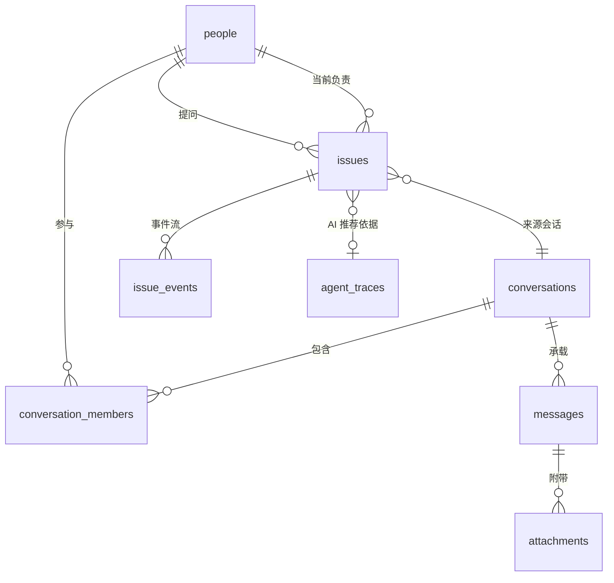
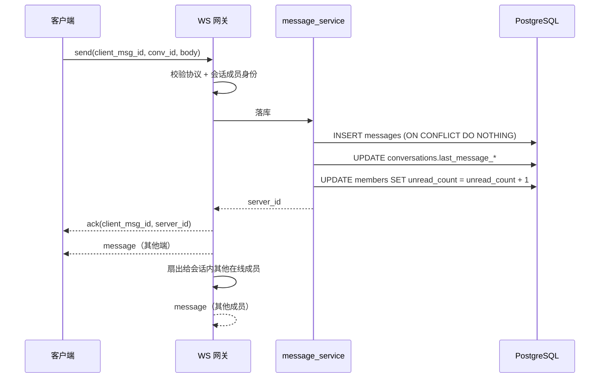
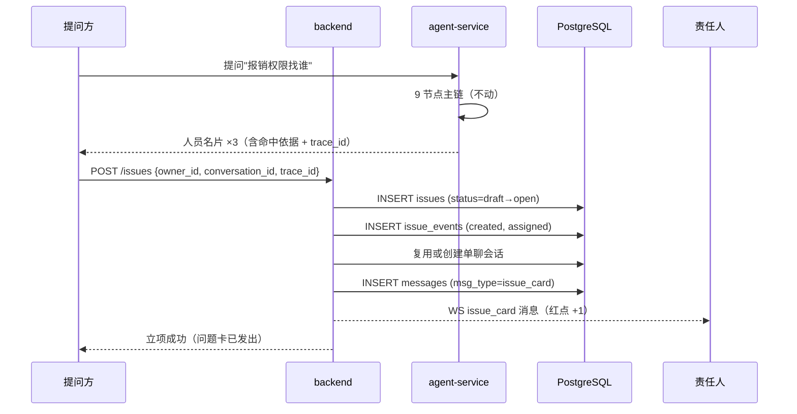
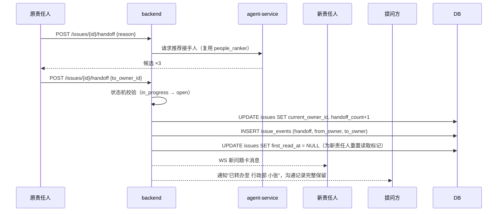
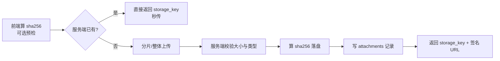

# FpIM 技术方案文档

> **文档编号**：02　｜　**版本**：v1.0（对应方案 v3 定稿）
> **日期**：2026-09-17　｜　**状态**：待评审
> **读者**：后端、前端、测试、运维
> **配套文档**：`01-产品需求文档-PRD.md`（业务规则）、`03-前端设计文档.md`（UI 规格）

---

## 目录

1. [架构总览](#1-架构总览)
2. [技术选型](#2-技术选型)
3. [数据模型与完整 DDL](#3-数据模型与完整-ddl)
4. [接口设计](#4-接口设计)
5. [WebSocket 协议](#5-websocket-协议)
6. [关键时序](#6-关键时序)
7. [关键实现细节](#7-关键实现细节)
8. [AI 集成](#8-ai-集成)
9. [文件存储与访问](#9-文件存储与访问)
10. [消息搜索](#10-消息搜索)
11. [报表计算](#11-报表计算)
12. [安全与合规](#12-安全与合规)
13. [部署与运维](#13-部署与运维)
14. [性能与容量](#14-性能与容量)
15. [开发规范与继承约束](#15-开发规范与继承约束)
16. [测试策略](#16-测试策略)

---

## 1. 架构总览

### 1.1 分层架构

```
┌─────────────────────────────────────────────────────────────────────┐
│  桌面客户端（Electron 壳 + 现有 Vue3 站点）                            │
│  桌面能力：全局截图快捷键 · 系统通知 · 开机自启 · 托盘 · 自动更新        │
└────────────┬────────────────────────────────┬───────────────────────┘
        HTTP + SSE（现有）                WebSocket（新增 /ws）
┌────────────┴────────────────────────────────┴───────────────────────┐
│  backend :8001 —— 业务唯一写入方（延续既有约束）                       │
│   ├ 现有：auth / people / departments / contents / reviews / admin    │
│   ├ 🆕 IM 网关：WS 连接、消息收发、群聊扇出、已读游标、离线增量拉取      │
│   ├ 🆕 issue 服务：问题状态机、转办、已读留痕、问题卡推送               │
│   ├ 🆕 upload 服务：本地磁盘内容寻址存储、缩略图、配额                   │
│   ├ 🆕 小管家服务：通知下发 + 报表卡推送 + 数据问答                     │
│   └ 🆕 report 服务：指标计算（注册进 statistics_definitions）+ 报告生成  │
└────────────┬─────────────────────────────────────────────────────────┘
             │ 只读调用
┌────────────┴─────────────────────────────────────────────────────────┐
│  agent-service :8100 —— 只读 / 只推理 / 只产草稿（主链完全不动）        │
│   现有：9 节点编排 / 概念治理 / 双路检索 / 可解释排序                    │
│   🆕 出口一：搜人结果 → issue draft（责任人候选 + 依据 + trace_id）     │
│   🆕 出口二：会话结束 → ai_summary 摘要 + "建议沉淀为知识"              │
│   🆕 出口三：转办 → 复用 people_ranker 推荐接手人                      │
└────────────┬─────────────────────────────────────────────────────────┘
             │
┌────────────┴─────────────────────────────────────────────────────────┐
│  PostgreSQL —— 三 schema + 新增 im schema                            │
│   public : 业务事实（people / departments / issues / issue_events）    │
│   agent  : AI（concepts / person_tags / traces / feedback）           │
│   rag    : 知识检索（512 维 Concept / 1536 维 RAG，严格隔离）          │
│   im     : 🆕 即时通讯（conversations / members / messages / …）       │
│                                                                      │
│  /data/fpim/files/{yyyy}/{mm}/{sha256[0:2]}/{sha256}.{ext}  ← 本地磁盘 │
└──────────────────────────────────────────────────────────────────────┘
```

### 1.2 三条必须继承的既有约束

| 约束 | 内容 | 在本次重构中的体现 |
|---|---|---|
| **AI 只产草稿** | agent-service 只读、只推理、只产草稿，业务写入必经 backend | AI 不得直接改 `issues.status`、不得主动发消息；立项/解决/转办全部走 backend |
| **分层降级是设计的一部分** | 每一层都要能降级 | AI 不可用时，IM 与问题闭环必须照常工作 |
| **两个向量空间继续隔离** | Concept 512 维 / RAG 1536 维，刻意不跨空间比较 | 本次不新增向量空间（消息搜索走全文检索，不用向量） |

### 1.3 模块划分（backend 新增）

```
backend/app/
├── api/
│   ├── im_conversations.py    # 会话管理
│   ├── im_messages.py         # 消息读写
│   ├── im_uploads.py          # 文件上传/下载
│   ├── issues.py              # 问题状态机
│   ├── people_ext.py          # 通讯录扩展
│   ├── reports.py             # 报表
│   ├── butler.py              # 小管家
│   └── search.py              # 消息搜索
├── im/
│   ├── ws_gateway.py          # WebSocket 网关与连接注册表
│   ├── protocol.py            # 帧协议定义与校验
│   ├── message_service.py     # 消息落库、幂等、扇出
│   ├── conversation_service.py# 会话创建（幂等单聊）
│   └── read_service.py        # 已读游标 + 首次已读留痕
├── issues/
│   ├── state_machine.py       # 状态机（纯函数、可单测）
│   ├── event_store.py         # issue_events 写入（唯一事实源）
│   └── card_service.py        # 问题卡消息投射
├── storage/
│   ├── base.py                # Storage 抽象接口
│   ├── local.py               # 本地磁盘实现（内容寻址）
│   └── signed_url.py          # 签名 URL
├── butler/
│   └── notify.py              # 小管家通知与报表卡推送
└── reports/
    ├── metrics.py             # 指标 SQL 注册
    └── dashboard.py           # 看板聚合
```

---

## 2. 技术选型

| 层 | 选型 | 理由 |
|---|---|---|
| **IM 传输** | FastAPI `WebSocket`（`uvicorn[standard]` 已含 `websockets`） | 现有依赖里已有；JSON 文本帧，不自造二进制协议（208 人规模下可读性与排障效率 > 极致性能） |
| **协议分工** | WS 管实时收发与推送；REST 管历史、上传、报表 | HTTP 可缓存、可重试、易调试；WS 只做轻量实时通道 |
| **消息存储** | PostgreSQL（与业务同库） | **决定性理由**：报表/统计全是 SQL 聚合，消息与 issue 同库同事务，才能保证"报表数字 = 聊天记录" |
| **连接管理** | 进程内注册表 `person_id → {conn}`，预留 Redis pub/sub | 单实例起步；扩容时加 Redis 广播，`messages.id` 仍是唯一顺序源 |
| **实时推送** | WS 直推（在线）+ DB 拉取（离线） | **不做离线消息队列**：消息永久落库，天然漫游 |
| **文件存储** | 本地磁盘 + 内容寻址 + nginx 签名 URL | 按决策 D5；抽象为 `Storage` 接口以便日后替换对象存储 |
| **桌面端** | Electron + 现有 Vue3 | 团队是 JS 栈；`globalShortcut`/`Notification`/`Tray`/`electron-updater` 开箱即用 |
| **问题闭环** | 自研状态机 + 轻量事件溯源 | 事件为唯一事实源，报表口径可追溯、可重算 |
| **报表** | 复用现有 `statistics_definitions` | 现有框架已是"指标 + formula(SQL) + refresh_cron"，不另起 ETL |
| **消息搜索** | 首期 `pg_trgm`，P3 应用层分词 + 原生 tsvector | **不依赖 DB 扩展**，可并行推进（详见 §10） |

### 2.1 为什么自研 IM 内核（决策 D1）

| 理由 | 说明 |
|---|---|
| **① 规模无风险** | 208 人、峰值并发 ≤100 长连接，单实例 uvicorn 足够。这个规模上引入 Kafka/Mongo/etcd 是**负资产** |
| **② 数据必须在自己库里（决定性）** | 全部价值是报表、问题状态、人才画像，全是 SQL 聚合。若消息在 MySQL/Mongo，就要维护同步管道，必然产生"报表数字 ≠ 聊天记录"的经典事故 |
| **③ 自定义消息类型与状态机同源** | `issue_card` / `resolve_confirm` / `handoff` / `report_card` 本质是状态机事件的投影。自研可以"事件落库 → 同时投射成消息"，一步到位 |

**诚实的代价**：IM 的长尾在**消息可靠性**（ACK / 重发 / 幂等 / 增量拉取 / 断线重连 / 多端同步）。**必须在写代码前先定死协议**（§5），否则后期返工代价极高。

**可退路径**：先自研单聊 MVP；万一不可控，沉没成本只有一个薄适配层（`Storage` 与 `ws_gateway` 都做了接口隔离）。反之若先上第三方 IM，后期深耦合时切换更贵。

---

## 3. 数据模型与完整 DDL

### 3.1 命名冲突（必须先解决）

⚠️ `public.sessions` / `public.messages` **已被 AI 问答占用**（backend `/api/v1/sessions`、`/api/agui/*`）。

→ IM 表**绝不能再叫 sessions / messages**，新建独立 schema **`im`**（与 `public` / `agent` / `rag` 并列）。现有 AI 问答表**保持不动**。

### 3.2 ER 关系



**关键关系**：**issue ↔ conversation 是 M:N**（不是 1:N）。
- 一个会话可以聊出**多个**问题
- 一个问题转办后会出现在**新**会话（甚至新建的问题群）

→ 用「**锚点 + 当前**双指针」落地：`source_conversation_id` + `source_message_id` 记录问题卡锚点，`current_owner_id` 记录当前责任人。

### 3.3 完整 DDL

```sql
-- =====================================================================
-- FpIM 数据库结构（新增部分）
-- 依赖：public.people / public.departments / public.audit_logs（既有）
-- 扩展：pg_trgm（既有）
-- =====================================================================

CREATE SCHEMA IF NOT EXISTS im;
CREATE EXTENSION IF NOT EXISTS pg_trgm;      -- 已存在则跳过

-- ==================== 会话 ====================
CREATE TABLE im.conversations (
    id                  bigserial PRIMARY KEY,
    type                text        NOT NULL CHECK (type IN ('direct','group')),
    direct_key          text,       -- 单聊唯一键：sorted(uid1,uid2) 拼接；群聊为 NULL
    name                text,       -- 群名（单聊为 NULL）
    avatar_key          text,       -- 群头像 storage_key
    owner_id            text        REFERENCES public.people(id),  -- 群主
    member_count        int         NOT NULL DEFAULT 0,            -- 冗余，便于列表渲染
    last_message_id     bigint,
    last_message_at     timestamptz,
    created_by          text        NOT NULL REFERENCES public.people(id),
    created_at          timestamptz NOT NULL DEFAULT now(),
    updated_at          timestamptz NOT NULL DEFAULT now()
);

-- ★ 单聊幂等：保证同一对人永远只有一个会话
CREATE UNIQUE INDEX uq_conv_direct_key
    ON im.conversations(direct_key) WHERE type = 'direct';

CREATE INDEX idx_conv_last_msg
    ON im.conversations(last_message_at DESC NULLS LAST);

-- ==================== 会话成员 ====================
CREATE TABLE im.conversation_members (
    conversation_id     bigint      NOT NULL REFERENCES im.conversations(id) ON DELETE CASCADE,
    person_id           text        NOT NULL REFERENCES public.people(id),
    role                text        NOT NULL DEFAULT 'member'
                        CHECK (role IN ('owner','member')),
    -- ★ 游标式已读：会被后续阅读覆盖，仅用于 UI 未读红点
    last_read_message_id bigint     NOT NULL DEFAULT 0,
    unread_count        int         NOT NULL DEFAULT 0,
    pinned              boolean     NOT NULL DEFAULT false,
    muted               boolean     NOT NULL DEFAULT false,
    joined_at           timestamptz NOT NULL DEFAULT now(),
    left_at             timestamptz,
    PRIMARY KEY (conversation_id, person_id)
);

CREATE INDEX idx_cm_person
    ON im.conversation_members(person_id) WHERE left_at IS NULL;

-- ==================== 消息 ====================
CREATE TABLE im.messages (
    id              bigserial   PRIMARY KEY,  -- ★全局单调递增 = 增量拉取唯一游标
    conversation_id bigint      NOT NULL REFERENCES im.conversations(id) ON DELETE CASCADE,
    sender_id       text        NOT NULL REFERENCES public.people(id),
    msg_type        text        NOT NULL,
    -- text | image | file | audio | video | system
    -- | issue_card | resolve_confirm | handoff | ai_summary | report_card
    body            text,
    payload         jsonb,      -- 卡片/富内容（问题卡快照、报表数据等）
    client_msg_id   text        NOT NULL,
    reply_to_id     bigint      REFERENCES im.messages(id),
    mentions        text[],     -- 群聊 @提及
    status          text        NOT NULL DEFAULT 'normal'
                    CHECK (status IN ('normal','revoked')),
    revoked_at      timestamptz,
    search_tsv      tsvector,   -- 检索列（P3 应用层分词写入；首期可为 NULL）
    created_at      timestamptz NOT NULL DEFAULT now()
);

-- ★ 幂等：同一个人用同一个 client_msg_id 重发不会产生重复消息
CREATE UNIQUE INDEX uq_msg_idempotent
    ON im.messages(sender_id, client_msg_id);

-- ★ 会话内顺序游标（主查询路径）
CREATE INDEX idx_msg_conv ON im.messages(conversation_id, id);

-- 全文检索：首期 trgm，P3 启用 tsvector（两条索引可共存，按需启用）
CREATE INDEX idx_msg_trgm ON im.messages USING gin (body gin_trgm_ops);
CREATE INDEX idx_msg_tsv  ON im.messages USING gin (search_tsv);

-- ==================== 附件 ====================
CREATE TABLE im.attachments (
    id            bigserial PRIMARY KEY,
    message_id    bigint      NOT NULL REFERENCES im.messages(id) ON DELETE CASCADE,
    filename      text        NOT NULL,     -- 原始文件名
    ext           text,
    size_bytes    bigint      NOT NULL,
    mime          text,
    storage_key   text        NOT NULL,     -- 相对路径 {yyyy}/{mm}/{ab}/{sha256}.{ext}
    sha256        char(64)    NOT NULL,     -- 内容寻址：去重 + 秒传
    width         int,
    height        int,
    duration_ms   int,
    created_at    timestamptz NOT NULL DEFAULT now()
);

CREATE INDEX idx_att_message ON im.attachments(message_id);
CREATE INDEX idx_att_sha256  ON im.attachments(sha256);

-- ==================== 问题（业务事实层，放 public）====================
CREATE TABLE public.issues (
    id                     bigserial PRIMARY KEY,
    title                  text        NOT NULL,
    body                   text,
    asker_id               text        NOT NULL REFERENCES public.people(id),
    current_owner_id       text        NOT NULL REFERENCES public.people(id),
    owner_department_id    int         REFERENCES public.departments(id),

    -- 来源追溯：把 AI 推荐依据串进来
    source_type            text        NOT NULL DEFAULT 'agent'
                           CHECK (source_type IN ('agent','manual')),
    source_conversation_id bigint      REFERENCES im.conversations(id),
    source_message_id      bigint      REFERENCES im.messages(id),  -- ★锚点消息
    source_agent_trace_id  text,                                    -- → agent.agent_traces
    concept_id             bigint,                                  -- → agent.concepts

    status                 text        NOT NULL DEFAULT 'draft'
                           CHECK (status IN ('draft','open','in_progress',
                                             'resolved','unresolved','cancelled')),
    priority               text        NOT NULL DEFAULT 'normal'
                           CHECK (priority IN ('low','normal','high')),

    -- ★ 留痕时间戳（全部由事件推导，应用层只写一次，不覆盖）
    created_at             timestamptz NOT NULL DEFAULT now(),
    first_read_at          timestamptz,   -- 被问方首次已读（证据）
    first_response_at      timestamptz,   -- 被问方首次回复（证据）
    resolved_at            timestamptz,
    closed_at              timestamptz,
    resolution_summary     text,

    handoff_count          int         NOT NULL DEFAULT 0,
    reopen_count           int         NOT NULL DEFAULT 0,
    updated_at             timestamptz NOT NULL DEFAULT now()
);

CREATE INDEX idx_issue_owner      ON public.issues(current_owner_id, status);
CREATE INDEX idx_issue_asker      ON public.issues(asker_id, created_at DESC);
CREATE INDEX idx_issue_dept       ON public.issues(owner_department_id, created_at DESC);
CREATE INDEX idx_issue_open       ON public.issues(status)
                                  WHERE status IN ('open','in_progress');
CREATE INDEX idx_issue_conv       ON public.issues(source_conversation_id);

-- ==================== 问题事件（唯一事实源）====================
CREATE TABLE public.issue_events (
    id            bigserial   PRIMARY KEY,
    issue_id      bigint      NOT NULL REFERENCES public.issues(id) ON DELETE CASCADE,
    event_type    text        NOT NULL,
    -- created | assigned | read | responded | accepted | handoff
    -- | resolved | reopened | unresolved | cancelled | knowledged | rated
    actor_id      text        REFERENCES public.people(id),
    from_owner_id text        REFERENCES public.people(id),
    to_owner_id   text        REFERENCES public.people(id),
    payload       jsonb,
    created_at    timestamptz NOT NULL DEFAULT now()
);

CREATE INDEX idx_ev_issue     ON public.issue_events(issue_id, created_at);
CREATE INDEX idx_ev_type_time ON public.issue_events(event_type, created_at DESC);

-- ★★ 关键约束：同一个责任人针对同一个 issue 只能有一条 read 事件
--    用数据库唯一索引保证"首次已读只记一次"，比应用层判断可靠
CREATE UNIQUE INDEX uq_ev_read_per_actor
    ON public.issue_events(issue_id, actor_id) WHERE event_type = 'read';
```

### 3.4 字段设计说明（为什么这么定）

| 设计 | 理由 |
|---|---|
| `messages.id` 作唯一顺序源 | 客户端时间不可信；bigserial 全局单调，天然满足会话内排序与增量拉取 |
| `uq_msg_idempotent` 唯一索引 | 网络抖动导致的重发由数据库兜底，应用层无需精确判断 |
| `direct_key` + 部分唯一索引 | 用数据库约束保证"同一对人只有一个会话"，避免并发建会话产生重复 |
| 已读**双存储** | 会话游标会被覆盖（供红点）；`issue_events.read` 永不覆盖（供留痕）。**混用会导致证据被冲掉** |
| `uq_ev_read_per_actor` | 首次已读的不可变性由 DB 保证；转办后新责任人可另记一条 |
| `issues` 只存投影字段 | 所有时间戳由事件推导；口径变更历史上可**重算** |
| `first_read_at` / `first_response_at` 现在就建 | **这是"砍掉超时机制仍然安全"的原因**：日后要恢复超时提醒，数据已积累，不用重构 |

---

## 4. 接口设计

### 4.1 接口总览（新增）

> 沿用现有 REST 风格 `/api/v1/*`；全部接口需登录态（JWT）。

#### 通讯录与人员

| 方法 | 路径 | 说明 |
|---|---|---|
| GET | `/api/v1/people` | 人员搜索（`keyword` / `department_id` / 分页；支持拼音） |
| GET | `/api/v1/people/{id}` | 人员详情（含直属上级、标签、画像） |
| GET | `/api/v1/people/{id}/profile` | 个人主页数据（含被问/解决指标） |
| GET | `/api/v1/departments/tree` | 组织树 |

#### 会话

| 方法 | 路径 | 说明 |
|---|---|---|
| GET | `/api/v1/im/conversations` | 我的会话列表（含未读数、最后一条消息） |
| POST | `/api/v1/im/conversations/direct` | **打开单聊（幂等）** `{person_id}` → `{conversation_id}` |
| POST | `/api/v1/im/conversations/group` | 建群 `{name, member_ids[]}` |
| GET | `/api/v1/im/conversations/{id}` | 会话详情（成员、群主、我的设置） |
| PATCH | `/api/v1/im/conversations/{id}` | 置顶 / 免打扰 / 群名 |
| POST | `/api/v1/im/conversations/{id}/members` | 添加成员（校验 100 人上限） |
| DELETE | `/api/v1/im/conversations/{id}/members/{pid}` | 移除成员 |
| **POST** | **`/api/v1/im/conversations/{id}/read`** | **上报已读游标** `{last_read_message_id}` |

#### 消息

| 方法 | 路径 | 说明 |
|---|---|---|
| GET | `/api/v1/im/conversations/{id}/messages` | 历史消息（`before_id` / `after_id` / `limit`） |
| GET | `/api/v1/im/sync` | **增量同步**（`after_id`，重连后拉取） |
| POST | `/api/v1/im/messages` | 发消息（HTTP 兜底通道，正常走 WS） |
| POST | `/api/v1/im/messages/{id}/revoke` | 撤回（2 分钟内） |
| GET | `/api/v1/im/search` | 消息搜索（`q` / `scope` / `conversation_id`） |

#### 文件

| 方法 | 路径 | 说明 |
|---|---|---|
| POST | `/api/v1/im/uploads` | 上传（multipart）→ `{storage_key, sha256, size, url}` |
| GET | `/api/v1/im/files/{storage_key}` | 下载（**签名 URL 校验**，防外传） |

#### 问题闭环

| 方法 | 路径 | 说明 |
|---|---|---|
| POST | `/api/v1/issues` | **立项** `{title, body, owner_id, concept_id?, source_*}` |
| GET | `/api/v1/issues` | 列表（`role=asker\|owner` / `status` / `filter=read_no_reply`） |
| GET | `/api/v1/issues/{id}` | 详情（含事件时间轴、关联会话） |
| **POST** | **`/api/v1/issues/{id}/read`** | **上报首次已读**（幂等，仅责任人有效） |
| POST | `/api/v1/issues/{id}/handoff` | 转办 `{to_owner_id, reason}` |
| POST | `/api/v1/issues/{id}/resolve` | **确认解决**（**仅提问方**）`{summary?}` |
| POST | `/api/v1/issues/{id}/unresolve` | 标记未解决 `{reason}` |
| POST | `/api/v1/issues/{id}/reopen` | 重新打开 `{reason}` |
| POST | `/api/v1/issues/{id}/cancel` | 撤销（仅提问方） |
| GET | `/api/v1/issues/{id}/events` | 事件流（时间轴渲染用） |
| POST | `/api/v1/issues/{id}/to-group` | 拉群会诊（创建问题群，**须指定唯一责任人**） |

#### 报表

| 方法 | 路径 | 说明 |
|---|---|---|
| GET | `/api/v1/reports/dashboard` | 平台大盘（`period=week\|month`） |
| GET | `/api/v1/reports/help-board` | 帮助榜 |
| GET | `/api/v1/reports/knowledge-gaps` | **知识缺口地图**（非排名） |
| GET | `/api/v1/reports/ask-board` | 提问榜 |
| GET | `/api/v1/reports/me` | 我的画像数据 |
| GET | `/api/v1/reports/detail` | 明细下钻（**仅管理员**） |

#### 小管家

| 方法 | 路径 | 说明 |
|---|---|---|
| GET | `/api/v1/butler/conversation` | 获取与小管家的常驻会话 |
| POST | `/api/v1/butler/query` | 数据问答 `{question}` → 数据卡 |
| POST | `/api/v1/butler/push` | 手动推送报表（**仅管理员**） |

### 4.2 通用约定

| 项 | 约定 |
|---|---|
| 认证 | JWT（沿用现有），WebSocket 通过 `?token=` 或首帧鉴权 |
| 分页 | 游标分页（`before_id` / `after_id`），不用 offset |
| 时间 | 统一 ISO 8601 带时区；**服务端时间为准** |
| 错误格式 | `{"code": "...", "message": "...", "detail": {}}` |
| 幂等 | 写操作支持 `Idempotency-Key` 头（关键操作：立项、解决） |
| 权限 | 服务端强制校验；小管家推送按被推送人权限过滤 |

---

## 5. WebSocket 协议

> **写代码前必须定死**。以下六件套是 IM 可靠性的全部核心。

### 5.1 六件套

| 问题 | 方案 |
|---|---|
| **消息顺序** | 服务端 `im.messages.id`（bigserial）作为会话内**单调游标**；客户端按此排序，**绝不用时间戳** |
| **幂等** | 客户端生成 `client_msg_id`（UUID）；DB 唯一索引 `(sender_id, client_msg_id)`；重发不产生重复 |
| **投递确认** | 服务端落库即回 `ack(client_msg_id → server_id)`；客户端**未收到 ack 才重发**（可无限重试，幂等兜底） |
| **离线 / 漫游** | 重连后按 `last_synced_id` **增量拉取**；**不做"离线消息队列"**（消息永久在库，天然漫游） |
| **已读** | **游标式**：`last_read_message_id` 单值上报，**不做逐条回执**（208 人规模下逐条回执是纯浪费） |
| **群聊扇出** | 单群上限 **100 人**；发消息时按成员数批量 `UPDATE unread_count`（100 人内无压力，不做异步队列） |

### 5.2 连接

```
GET /ws?token=<JWT>   →  101 Switching Protocols
```

- 单账号允许多端连接（连接注册表为 `person_id → Set[conn]`）。
- **心跳**：客户端每 30s 发 `ping`，服务端回 `pong`；60s 无心跳服务端主动断开。
- **断线重连**：指数退避（1s / 2s / 4s / 8s，上限 30s）；重连成功后走 `GET /api/v1/im/sync?after_id=<last_synced_id>` 补齐。

### 5.3 帧定义

**客户端 → 服务端**

```jsonc
// 发送消息
{ "type": "send",
  "client_msg_id": "uuid-v4",
  "conversation_id": 123,
  "msg_type": "text",
  "body": "报销权限怎么申请？",
  "reply_to_id": null,
  "mentions": [],
  "payload": null }

// 上报已读游标
{ "type": "ack_read",
  "conversation_id": 123,
  "last_read_message_id": 456 }

// 正在输入（可选，弱功能）
{ "type": "typing", "conversation_id": 123 }

// 心跳
{ "type": "ping" }
```

**服务端 → 客户端**

```jsonc
// 收到即落库，返回服务端 ID
{ "type": "ack",
  "client_msg_id": "uuid-v4",
  "server_id": 789,
  "created_at": "2026-09-17T10:00:00+08:00" }

// 新消息（含自己其他端与对方的消息）
{ "type": "message",
  "conversation_id": 123,
  "message": {
    "id": 789, "sender_id": "u-001", "msg_type": "text",
    "body": "...", "payload": null, "created_at": "..." } }

// 对方已读
{ "type": "read",
  "conversation_id": 123,
  "person_id": "u-002",
  "last_read_message_id": 456 }

// 会话变更（新建群、成员变动、问题卡状态更新）
{ "type": "conversation_update", "conversation_id": 123, "patch": {} }

// 问题状态变更（用于前端刷新问题卡徽标）
{ "type": "issue_update", "issue_id": 88, "status": "resolved", "issue": {} }

{ "type": "pong" }

// 错误（带 client_msg_id 便于客户端定位并决定是否重发）
{ "type": "error",
  "client_msg_id": "uuid-v4",
  "code": "CONVERSATION_NOT_FOUND",
  "message": "会话不存在" }
```

### 5.4 客户端状态机（前端必须实现）

```
IDLE ──send──→ SENDING ──ack──→ SENT
                   │
                   └──超时(10s)──→ 重发（最多 3 次，之后标红并提供手动重发）
                                     ↑ 幂等保证重发不产生重复消息
```

---

## 6. 关键时序

### 6.1 发送消息



### 6.2 立项（AI 搜人 → 问题卡）



### 6.3 首次已读留痕（本期核心机制）

```mermaid
sequenceDiagram
    participant O as 责任人
    participant B as backend
    participant DB as PostgreSQL

    O->>B: 打开会话，问题卡进入视口
    O->>B: POST /im/conversations/{id}/read {last_read_message_id}
    B->>DB: UPDATE conversation_members SET last_read_message_id, unread_count=0
    B->>B: 判断：该条范围内是否有 issue_card？
    alt 是 issue_card 且我是 current_owner_id 且 first_read_at IS NULL
        B->>DB: INSERT issue_events (read, actor_id=me)
                 ON CONFLICT (issue_id, actor_id) WHERE type='read' DO NOTHING
        B->>DB: UPDATE issues SET first_read_at = now() WHERE first_read_at IS NULL
        B-->>O: WS issue_update（徽标变为「已读」）
        B-->>B: 广播给提问方（他看到「已读 3 小时后回复」）
    end
```

> **注意**：`ON CONFLICT DO NOTHING` + 部分唯一索引保证**只记第一次**；`WHERE first_read_at IS NULL` 保证并发下不会覆盖。

### 6.4 转办



---

## 7. 关键实现细节

### 7.1 单聊会话幂等创建

```python
def get_or_create_direct(db, a: str, b: str) -> int:
    key = ":".join(sorted([a, b]))
    row = db.execute(text("""
        INSERT INTO im.conversations (type, direct_key, created_by)
        VALUES ('direct', :key, :creator)
        ON CONFLICT (direct_key) WHERE type='direct'
        DO UPDATE SET updated_at = now()
        RETURNING id
    """), {"key": key, "creator": a}).scalar_one()
    return row
```

> **要点**：用 `ON CONFLICT ... DO UPDATE ... RETURNING` 一步完成"查或建"，天然并发安全，不需要分布式锁。

### 7.2 消息幂等写入

```python
row = db.execute(text("""
    INSERT INTO im.messages
        (conversation_id, sender_id, msg_type, body, payload,
         client_msg_id, reply_to_id, mentions)
    VALUES (:cid, :sid, :mtype, :body, :payload,
            :cmid, :reply, :mentions)
    ON CONFLICT (sender_id, client_msg_id) DO NOTHING
    RETURNING id, created_at
"""), {...}).first()

if row is None:      # 已存在 → 查回原记录（重发场景）
    row = db.execute(text("""
        SELECT id, created_at FROM im.messages
        WHERE sender_id = :sid AND client_msg_id = :cmid
    """), {...}).one()
```

### 7.3 首次已读的原子写入

```python
# 1) 先写事件（唯一索引兜底），
inserted = db.execute(text("""
    INSERT INTO public.issue_events (issue_id, event_type, actor_id, payload)
    VALUES (:iid, 'read', :actor, :payload)
    ON CONFLICT (issue_id, actor_id) WHERE event_type='read' DO NOTHING
    RETURNING id
"""), {...}).first()

# 2) 只有真正插入成功（第一次），才更新投影字段
if inserted:
    db.execute(text("""
        UPDATE public.issues SET first_read_at = now()
        WHERE id = :iid AND first_read_at IS NULL
    """), {"iid": iid})
```

> **为什么这个顺序**：先写事实（事件），再更新投影。即使中途失败，事实仍在，可以通过重算修复投影。反过来则可能"投影说有，事件里查不到"。

### 7.4 群聊未读扇出

```python
# 一次更新所有成员（100 人内无压力）
db.execute(text("""
    UPDATE im.conversation_members
       SET unread_count = unread_count + 1
     WHERE conversation_id = :cid
       AND person_id <> :sender
       AND left_at IS NULL
"""), {"cid": cid, "sender": sender_id})
```

### 7.5 状态机（纯函数，可单测）

```python
TRANSITIONS = {
    "draft":       {"open", "cancelled"},
    "open":        {"in_progress", "cancelled", "resolved"},
    "in_progress": {"resolved", "unresolved", "open"},   # open = 转办
    "resolved":    {"open"},                             # reopen
    "unresolved":  {"open"},                             # reopen
    "cancelled":   set(),
}

# 权限规则：谁可以触发哪个动作
ACTORS = {
    "resolve":   "asker_only",    # ★仅提问方能确认解决
    "cancel":    "asker_only",
    "reopen":    "asker_only",
    "handoff":   "owner_only",
    "unresolve": "both",
}
```

---

## 8. AI 集成

### 8.1 三个出口（现有主链完全不动）

| 出口 | 触发时机 | agent-service 产出 | backend 消费 |
|---|---|---|---|
| **出口一：入场** | 用户提问 | 责任人候选 + 命中依据 + `agent_trace_id` | 生成立项草稿 → 用户确认后建 issue |
| **出口二：场中** | issue 关闭时 | `ai_summary` 摘要 + "建议沉淀为知识"标记 | 作为消息写入会话 |
| **出口三：横向** | 转办请求 | 接手人候选（复用 `people_ranker`） | 填充转办选择列表 |

### 8.2 必须遵守的约束（写进开发规范）

- ❌ AI **不得**直接修改 `issues.status`、**不得**主动发消息 —— 只产草稿/建议
- ❌ 两个向量空间（Concept 512 维 / RAG 1536 维）**继续隔离**，本次不新增向量空间
- ✅ **分层降级**：AI 不可用时，IM 收发、问题状态机、已读留痕必须**完全正常**（AI 是增强，不是依赖）
- ✅ 每次 AI 调用都要落 `agent_traces`，保证"为什么找的是他"可回溯

### 8.3 调用方式

backend → agent-service 走现有 HTTP 契约（`/api/agui/*` 或内部 API），**不引入新的通信中间件**。超时 3s，失败即降级（返回空候选/不生成摘要）。

---

## 9. 文件存储与访问

### 9.1 内容寻址路径

```
/data/fpim/files/{yyyy}/{mm}/{sha256[0:2]}/{sha256}.{ext}
```

逻辑：上传时先算 `sha256` → 命中已有文件直接复用（**秒传**）→ 未命中才落盘。`im.attachments.storage_key` 存相对路径。

**收益**：天然去重；同一文件多人转发只存一份；磁盘占用可控。

### 9.2 上传流程



### 9.3 访问与防外传

nginx 直接静态服务 + **签名 URL**：

```
GET /api/v1/im/files/{storage_key}?expires=<ts>&sign=<hmac>

sign = HMAC_SHA256(secret, f"{storage_key}:{expires}")
```

- 校验 `expires` 未过期 + `sign` 匹配 + **请求者在该文件的可见范围内**。
- 目的：避免裸链被转发到外部。

### 9.4 存储抽象（为将来换对象存储准备）

```python
class Storage(Protocol):
    def put(self, data: BinaryIO, sha256: str, ext: str) -> str: ...
    def get(self, storage_key: str) -> BinaryIO: ...
    def exists(self, sha256: str, ext: str) -> str | None: ...
    def delete(self, storage_key: str) -> None: ...
```

> **单实例用本地磁盘没问题**；一旦扩多实例，本地盘无法共享，必须换对象存储 —— 接口已隔离，替换成本低。

### 9.5 配额与限制

| 项 | 值 |
|---|---|
| 单文件上限 | 100MB |
| 单人总量 | 5GB |
| 类型限制 | 白名单：图片 / 文档 / 音视频 / 压缩包；**禁止可执行文件** |
| 磁盘告警 | 使用率 > 80% 告警（**盘满会导致附件不可用**） |

**容量测算**（208 人）：人均日发 3 个附件 × 约 500KB ≈ 312MB/天 → 约 **78GB/年**；含大文件放大 2~3 倍 → **150~250GB/年** → **建议划 1TB 独立分区**。

---

## 10. 消息搜索

### 10.1 问题本质

PG 自带全文检索按"**词**"切分。英文有空格天然分词；**中文没有空格**，默认解析器会把整句当成一个 token → **搜不出来**。所以中文检索通常需要 `zhparser` / `pg_jieba` 这类**中文分词扩展**（C 扩展，需 DBA 编译安装）。现有库只有 `pg_trgm`。

### 10.2 三条路线

| 路线 | 做法 | 优点 | 缺点 |
|---|---|---|---|
| A. 装 DB 扩展 | `CREATE EXTENSION zhparser` → `to_tsvector('chinese', body)` | 效果最好：按词检索、相关度排序、高亮 | 需 DBA 编译；托管 PG 可能不给装 |
| **B. 应用层分词** ⭐ | Python `jieba` 分词 → 写入 `messages.search_tsv` → PG 内置 `simple` 配置建 GIN | **不依赖 DB 扩展**；分词器可控可换 | 多一列 + 写入多一步；词库升级需重建索引 |
| **C. `pg_trgm`** | `body ILIKE '%kw%'` + GIN trgm 索引 | 零依赖，**现在就能用** | 无"词"概念、**无法相关度排序**；输入整句搜不到 |

**决策**：
- **P1 首期用 C**（半天工作量，功能不缺）
- **P3 升级为 B**（体验对齐搜索引擎）
- **A 仅在 DBA 同意时考虑**

→ **不阻塞开工**，可与其他工作并行。

### 10.3 比索引技术更重要：先定搜索范围

| 范围 | 建议 |
|---|---|
| 会话内搜索 | ✅ 必做，无隐私问题，数据量极小 |
| "我参与的会话"范围 | ✅ 推荐，覆盖 90% 真实需求 |
| 全员全局搜索 | ⚠️ **加权限过滤 + 范围限制**，限"我参与的会话 + 部门内公开群" |
| 审计级检索 | 仅管理员，**必须留审计日志** |

> **一句话**：范围收敛到"我参与的会话"，用方案 C 也足够快；真正的风险不是性能，而是**让员工搜到与自己无关的私人对话**。

---

## 11. 报表计算

### 11.1 复用现有统计框架

现有 `public.statistics_definitions`（`metric_key` / **`formula` = 一段 SELECT SQL** / `refresh_cron`）+ `public.statistics_data`（`metric_key` / `value` / `dimension` / `stat_date`）。

→ **指标注册进这里，复用现有定时刷新机制**，不另起 ETL。

### 11.2 指标 SQL 示例

```sql
-- M6 已读未回复率（本期核心风险指标）
INSERT INTO public.statistics_definitions (metric_key, name, formula, refresh_cron)
VALUES (
  'issue.read_no_reply_rate',
  '已读未回复率',
  $$
  SELECT
    COUNT(*) FILTER (WHERE has_read AND NOT has_reply)::numeric
      / NULLIF(COUNT(*), 0) AS value
  FROM (
    SELECT i.id,
           (i.first_read_at IS NOT NULL) AS has_read,
           (i.first_response_at IS NOT NULL) AS has_reply
    FROM public.issues i
    WHERE i.created_at >= date_trunc('day', now() - interval '7 days')
  ) t
  $$,
  '0 8 * * *'
);

-- M4 首次已读时长（输出分位数，无红线）
-- 中位数与 90 分位由报表层用 percentile_cont 计算，存入 statistics_data
```

### 11.3 指标口径表（与 PRD §7 一致）

| 指标 | 口径要点 | 是否进选拔 |
|---|---|---|
| 提问量 / 部门被问量 | 去重计数 | ❌ 仅观察 |
| 首次已读时长 / 首次回复时长 | **中位数 + 90 分位**（无红线） | ✅ 画像维度 |
| **已读未回复率** | 有 `read` 无 `responded` 占比 | ✅ **核心风险指标** |
| 解决率 | `resolved` /（`resolved`+`unresolved`） | ✅ |
| 二次转办率 / reopen 率 | 从事件表聚合 | ✅ 负向 |
| 知识沉淀贡献 | 沉淀条数 + 被复用次数 | ✅ |
| 提问价值 | 三层漏斗，仅 L3 进选拔 | ✅（仅 L3） |

### 11.4 反刷量约束

**进榜指标必须有下游动作背书**：已解决 / 被问方确认有效 / 沉淀为知识并被复用 / 提问方有效评价。
单纯"答得多""问得多"**不计分**（在 SQL 层通过事件关联实现，而非应用层过滤）。

---

## 12. 安全与合规

| 类别 | 措施 |
|---|---|
| **认证** | 沿用现有 JWT；WS 连接同样校验 |
| **授权** | 服务端强制校验；会话成员校验在 WS 与 REST 双端都做 |
| **文件安全** | 签名 URL + 有效期；类型白名单；禁止执行 |
| **越权防护** | 小管家推送按接收者权限过滤（**服务端强制**，不靠前端隐藏） |
| **审计** | 复用 `public.audit_logs`；审计检索、管理员操作全部留痕 |
| **隐私边界** | 全局搜索默认收敛；个人主页仅公开字段；考核明细仅管理员可见 |
| **事前告知** | 使用协议中明确"工作沟通在平台留痕、公司可审计" |
| **数据保留** | 消息与问题**长期保留**（不做 365 天过期），配备归档与冷热分离策略 |
| **SQL 注入** | 全部使用参数化查询（指标 formula 只允许管理员维护） |

---

## 13. 部署与运维

### 13.1 部署拓扑（单实例起步）

```
                    ┌──────────────┐
   用户 / 桌面端 ────→│    nginx     │  ← TLS、静态资源、文件下载（签名校验）
                    └──────┬───────┘
                           │
              ┌────────────┴────────────┐
              │                         │
    ┌─────────▼─────────┐    ┌──────────▼──────────┐
    │  backend :8001    │───→│  agent-service :8100 │
    │  HTTP + /ws       │    │  （只读 / 只推理）    │
    └─────────┬─────────┘    └──────────┬───────────┘
              │                         │
              └────────────┬────────────┘
                    ┌──────▼──────┐
                    │ PostgreSQL   │
                    └──────┬──────┘
                           │
                 ┌─────────▼──────────┐
                 │ /data/fpim/files   │  ← 本地磁盘（约 1TB）
                 └────────────────────┘
```

### 13.2 进程与扩容

| 阶段 | 方案 |
|---|---|
| 单实例 | `uvicorn` 多 worker；WS 连接注册表在进程内（**注意：多 worker 时需共享**） |
| 起步建议 | **WS 网关单独一个进程（单 worker）**，HTTP 可多 worker |
| 扩容 | 加 Redis pub/sub 广播；`messages.id` 仍是唯一顺序源 |
| 存储扩容 | 本地盘 → 对象存储（`Storage` 接口已隔离） |

### 13.3 监控告警

| 指标 | 阈值 |
|---|---|
| **磁盘水位** | > 80% 告警（盘满 = 附件不可用） |
| WS 连接数 | 突降告警（可能服务异常） |
| 消息落库延迟 | P99 > 500ms 告警 |
| 未 ack 消息比例 | > 1% 告警 |
| AI 服务可用性 | 降级不影响主流程，但要监控 |
| 数据库连接池 | 使用率 > 80% 告警 |

### 13.4 备份（**必须有责任人**）

| 对象 | 说明 | 优先级 |
|---|---|---|
| **PostgreSQL** | 消息正文、`issue_events` 事件流、`issues` 状态 —— **不可再生**，比文件更关键 | ★★★ |
| **文件目录** | `/data/fpim/files` | ★★ |

> ⚠️ **常见误区**：以为"文件存本地"只需备份文件。**真正不可再生的其实是数据库**——文件丢了还能让人重发，事件流丢了考核与报表的历史就永久断了。

**问 IT 的三个问题**：
1. 数据库现在有定时备份吗？备份放哪、保留多久、做过恢复演练吗？
2. 除数据库外，约 1TB 的文件目录要不要纳入同一套备份？谁负责配置和监控？
3. 有没有 NAS 或共享存储可挂载？

---

## 14. 性能与容量

### 14.1 容量基线

| 项 | 数值 |
|---|---|
| 用户数 | 208 |
| 峰值并发 WS 连接 | ≤ 100 |
| 消息量（3 年） | 约 150 万条 |
| 文件年增量 | 78GB（含大文件放大 150~250GB） |
| 单群上限 | 100 人 |

### 14.2 性能目标

| 操作 | 目标 |
|---|---|
| 消息发送 → 对方接收（在线） | ≤ 1s |
| 会话列表加载 | ≤ 500ms |
| 历史消息分页（50 条） | ≤ 300ms |
| 消息搜索 | ≤ 1s |
| 看板加载 | ≤ 2s（走预计算） |

### 14.3 优化策略

| 场景 | 策略 |
|---|---|
| 会话列表 | 冗余 `last_message_id` / `last_message_at`，避免子查询 |
| 历史消息 | 游标分页（`before_id`），走 `(conversation_id, id)` 索引 |
| 未读计数 | 冗余 `unread_count` 列，避免每次 COUNT |
| 搜索 | 限定范围；首期 trgm，P3 转 tsvector |
| 看板 | 走 `statistics_data` 预计算，不实时算 |
| 大群扇出 | 100 人内直接批量 UPDATE，不做异步队列 |

---

## 15. 开发规范与继承约束

### 15.1 硬约束（不可绕过）

| # | 约束 |
|---|---|
| 1 | **AI 只产草稿**：agent-service 只读、只推理、只产草稿；业务写入必经 backend |
| 2 | **分层降级是设计的一部分**：AI 挂了，IM 与问题闭环必须照常工作 |
| 3 | **两个向量空间不合并**（Concept 512 / RAG 1536） |
| 4 | **所有状态变更必须落 `issue_events`**；`issues` 表只是投影 |
| 5 | **`resolved` 只能由提问方确认**，被问方无此权限 |
| 6 | **首次已读不可撤销、不可覆盖**（DB 唯一索引保证） |
| 7 | **消息排序用服务端 id，绝不用客户端时间戳** |
| 8 | **不改动现有 `public.sessions` / `public.messages`**（AI 问答专用） |

### 15.2 代码规范

- 状态机写成**纯函数**，便于单测覆盖全路径
- 所有写操作考虑**幂等**（关键操作带 `Idempotency-Key`）
- 时间统一用 `timestamptz`，服务端时间为准
- 新增数据库对象必须写迁移脚本（沿用现有 alembic 体系）
- SQL 全部参数化

### 15.3 目录约定

见 §1.3。命名统一为 `im_*`（IM 相关）、`issues/*`（问题闭环）、`reports/*`（报表），与现有模块风格保持一致。

---

## 16. 测试策略

### 16.1 单元测试

| 对象 | 覆盖点 |
|---|---|
| 状态机 | **全路径**：每条合法转换 + 所有非法转换拒绝 + 权限校验（如被问方调 resolve 必须失败） |
| 幂等 | 单聊创建、消息写入、已读上报的重复调用 |
| 签名 URL | 过期、篡改、越权访问 |

### 16.2 集成测试

| 场景 | 验证 |
|---|---|
| 消息可靠性 | 断线重连不重不漏、乱序到达后重新排序正确 |
| 重发 | 同一 `client_msg_id` 发 3 次，DB 只有 1 条 |
| 首次已读 | 重复上报多次，`issue_events` 只有 1 条，`first_read_at` 不变 |
| 转办 | 新责任人可另记 read；原责任人不可重复记 |
| 群上限 | 第 101 人被拒绝 |
| 权限 | 非提问方调 resolve 返回 403 |
| 降级 | 停掉 agent-service，IM 与 issue 闭环全部正常 |

### 16.3 性能测试

- 100 并发 WS 长连接下的消息收发延迟
- 100 人群消息扇出耗时
- 150 万条消息下的搜索响应
- 看板查询耗时

### 16.4 验收测试

按 PRD 的验收标准逐条执行（每条「给定…当…则…」均可直接转用例）。

---

## 附录 A：新增对象清单

| 类型 | 对象 | 说明 |
|---|---|---|
| Schema | `im` | IM 专用 |
| Table | `im.conversations` | 会话（单聊 + 群聊） |
| Table | `im.conversation_members` | 会话成员（含已读游标） |
| Table | `im.messages` | 消息 |
| Table | `im.attachments` | 附件 |
| Table | `public.issues` | 问题（投影） |
| Table | `public.issue_events` | 问题事件（唯一事实源） |
| View/函数 | 建议后续按需增加 | 报表口径视图 |
| 索引 | 见 §3.3 | 共 20+ 个，含 2 个关键唯一索引 |

## 附录 B：复用现有资产清单

| 现有资产 | 处置 |
|---|---|
| `agent-service` 智能主链（9 节点） | ✅ 完全复用，仅加三个出口 |
| 概念 / 标签三层治理 | ✅ 复用（`issues.concept_id` 挂接） |
| AGUI SSE 契约 | ✅ 复用（AI 助手面板） |
| 组织树 / 通讯录 | ✅ 复用 + 改造 |
| `people.manager_id` | ✅ 复用（**仅个人主页展示上级**；原升级通知用途已随超时机制移除） |
| `responsibility_assignments` | ⏸ **本期不使用**（数据保留，日后恢复超时机制可直接启用） |
| `statistics_definitions` / `statistics_data` | ✅ 复用（指标注册进去） |
| `audit_logs` | ✅ 复用（IM 审计） |
| `feedback` / `agent.feedback_events` | ✅ 复用（提问价值评价） |
| `agent_traces` / `node_spans` | ✅ 复用（推荐依据可回溯） |
| `public.sessions` / `messages` | ⚠️ **保持不动**（AI 问答专用） |

## 附录 C：开发顺序建议

| 顺序 | 内容 | 理由 |
|---|---|---|
| 1 | DDL 迁移脚本 + 状态机纯函数 + 单测 | 地基，无依赖 |
| 2 | IM 网关 + 单聊 + 消息落库 + 幂等 | 技术风险最高，先趟坑 |
| 3 | 群聊 + 已读游标 + 增量同步 | IM 完整性 |
| 4 | 文件上传下载 + 签名 URL | 依赖存储决策 |
| 5 | 问题闭环 + 首次已读 + 转办 | 业务核心 |
| 6 | AI 三个出口对接 | 依赖前两步 |
| 7 | 桌面壳 | 可与 2~6 并行 |
| 8 | 报表 + 小管家 | 依赖数据积累 |
